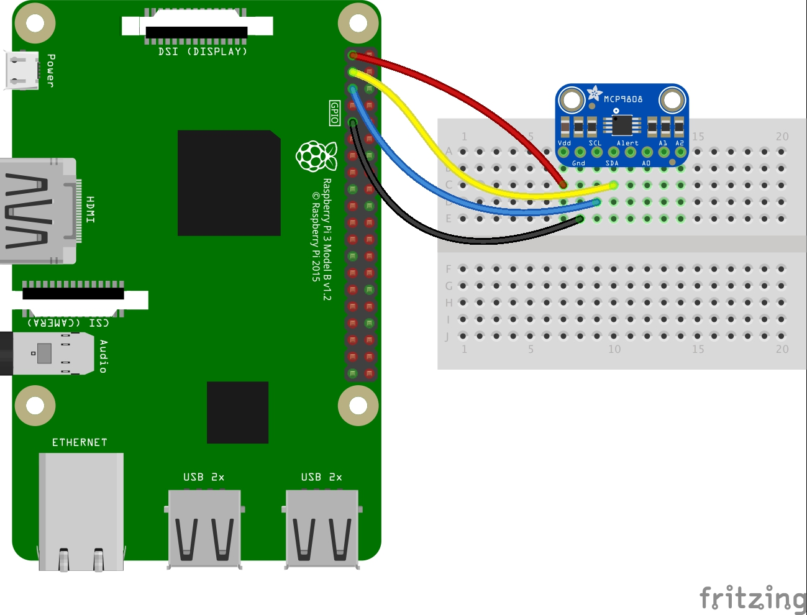

# Raspberry Pi Temperature Sensor
This application will publish temperature readings to the AWS IoT platform from an MCP9808 connected to a Raspberry Pi.

It's assumed that an AWS IoT thing shadow already exists along with the appropriate policy for updating the shadow.

Also, the certificates should be handy.

## Getting Started

### Prerequisites
This was designed to run on the latest version of Raspbian.

Wire up the MCP9808 to the Pi


Ensure that i2c is enabled on the Raspberry Pi

Ensure that pigpio is installed
```
sudo apt-get install pigpio
```

[Install Node](https://github.com/nebrius/raspi-io/wiki/Getting-a-Raspberry-Pi-ready-for-NodeBots#installing-nodejs)

[Install Yarn](https://yarnpkg.com/lang/en/docs/install/#debian-stable)

### Installing
Create a `.env` file with the following from AWS IoT:
```
keyPath=<YourPrivateKeyPath>
certPath=<YourCertificatePath>
caPath=<YourRootCACertificatePath>
clientId=<YourUniqueClientIdentifier>
host=<YourCustomEndpoint>
thingName=<YourThingName>
combinedLog=<CombinedLogPath>
errorLog=<ErrorLogPath>
```

Install dependencies
```
yarn
```

Run the script to read the temperature and update the shadow
```
yarn start
```

